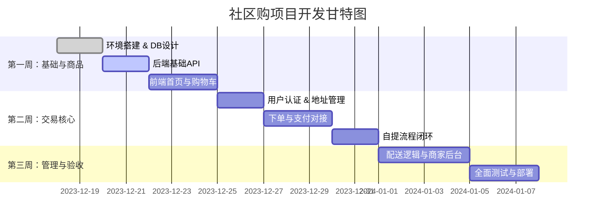

# 社区购小程序项目开发规划方案 (V1.0)

## 1. 项目概况
本项目旨在构建一套轻量级的社区团购/外卖小程序系统，支持“配送”与“自提”双模式，采用直连微信支付资金流，由商家自主管理订单配送与核销。系统包含用户端小程序、商家端小程序及PC管理后台。

**核心文档依据：**
- 需求与业务流程：`docs/产品文档.md`
- 接口规范：`docs/API规划.md`
- 数据架构：`docs/db 规划.md`

---

## 2. 项目里程碑与时间节点 (MVP 3周计划)
基于文档中的 "MVP Roadmap"，项目分为三个阶段，预计总工期为 3 周。

### 📅 Phase 1: 基础架构与商品展示 (第1周)
**目标：** 完成前后端基础搭建，实现商品浏览与购物车功能。
- **T1-T2:** 环境搭建 (PostgreSQL, FastAPI, Uni-app)、数据库建表 (`shop_config`, `products`, `categories`)。
- **T3-T4:** 后端基础接口开发 (分类列表, 商品列表, 详情)。
- **T5-T6:** 前端首页、分类页、购物车页面开发 (本地缓存逻辑)。
- **T7:** 联调测试与UI微调。

### 📅 Phase 2: 交易核心与支付流程 (第2周)
**目标：** 打通下单、支付、订单状态流转（重点是自提流程）。
- **T1-T2:** 用户认证模块 (微信登录, JWT生成)、收货地址管理。
- **T3-T4:** 订单核心逻辑开发 (下单接口 `order/create`, 预检接口 `preview`)。
- **T5:** 微信支付对接 (统一下单, 回调处理 webhook)。
- **T6:** 自提流程闭环 (生成6位取货码, 扫码核销接口)。
- **T7:** 交易流程联调 (确保状态机 `0->2->4` 正常流转)。

### 📅 Phase 3: 配送管理与商家后台 (第3周)
**目标：** 完善配送模式，上线商家管理功能，进行整体验收。
- **T1-T2:** 配送模式逻辑 (地址快照, 商家接单/拒单接口 `admin/order/audit`)。
- **T3-T4:** 商家端小程序/PC后台开发 (订单列表, 接单操作, 扫码核销)。
- **T5:** 营业时间判断逻辑 (前端拦截 + 后端校验)。
- **T6:** 系统全面测试 (并发锁测试, 边界条件测试)。
- **T7:** 部署上线与文档交付。

---

## 3. 功能模块详细划分

### 3.1 C端用户小程序 (store-mini)
| 模块 | 功能点 | 对应API/文档 |
| :--- | :--- | :--- |
| **用户认证** | 微信授权登录、JWT Token管理 | `POST /auth/login` |
| **商品展示** | 首页Banner、分类侧边栏、商品列表、商品详情 | `products` 表 |
| **购物车** | 添加/减少商品、本地持久化、结算预览 | `POST /order/preview` |
| **订单交易** | 填写备注、选择配送/自提、微信支付调起 | `POST /order/create` |
| **个人中心** | 我的订单列表、订单详情(展示核销码)、地址管理 | `GET /order/list` |

### 3.2 商家端小程序/PC (store-server-mini/pc)
| 模块 | 功能点 | 对应API/文档 |
| :--- | :--- | :--- |
| **工作台** | 待处理订单概览、新订单语音播报 | WebSocket/轮询 |
| **订单管理** | 待接单列表(接单/拒单)、配送中(确认送达)、自提(扫码核销) | `POST /admin/order/audit` |
| **商品管理** | 商品上下架、价格修改、库存调整 | `products` 表 |
| **店铺设置** | 营业状态开关、营业时间设置、运费配置 | `shop_config` 表 |

---

## 4. 技术架构设计

### 4.1 技术栈 (依据 `docs/产品文档.md`)
- **前端 (User/Merchant):** Uni-app (Vue 3 + TypeScript) - 一套代码发布微信小程序。
- **商家PC后台:** Vue 3 + Vite + Element Plus。
- **后端:** Python FastAPI (异步高性能框架)。
- **数据库:** PostgreSQL (使用 `asyncpg` 驱动)。
- **部署:** Docker 容器化部署。

### 4.2 目录结构规划
```text
/Users/hanxiaodi/www/node/store/
├── docs/                 # 项目文档
├── store-mini/           # C端小程序 (Uni-app)
├── store-server-mini/    # 商家端小程序 (Uni-app)
├── store-server-pc/      # 商家PC后台 (Vue3)
└── store-api/            # 后端API (FastAPI)
    ├── app/
    │   ├── api/v1/       # 接口路由
    │   ├── core/         # 配置与安全
    │   ├── models/       # SQLAlchemy/Tortoise 模型
    │   └── services/     # 业务逻辑 (订单状态机)
    └── alembic/          # 数据库迁移
```

### 4.3 数据库关键设计 (依据 `docs/db 规划.md`)
- **核心表:** `orders` (交易), `order_items` (快照), `shop_config` (配置).
- **关键机制:**
    - **地址快照 (`JSONB`):** 订单生成时固化地址信息，不随用户修改地址簿变化。
    - **数值精度:** 金额统一使用 `NUMERIC(10, 2)`，严禁 float。
    - **时间处理:** 统一使用 `TIMESTAMPTZ`。

---

## 5. 开发资源分配方案

| 角色 | 人员 | 职责范围 |
| :--- | :--- | :--- |
| **后端开发** | 1人 | API设计与实现、数据库管理、支付接口对接、云服务器部署 |
| **前端开发** | 1人 | C端小程序、商家端小程序、PC后台界面开发与联调 |
| **测试/PM** | 1人 | 需求把控、用例编写、验收测试 (可由产品经理兼任) |

*注：鉴于项目规模，建议采用全栈开发模式或紧密配合的 2 人小组。*

---

## 6. 质量保证措施 (QA)

1.  **代码规范:**
    - 前端：ESLint + Prettier (Vue3 Standard)。
    - 后端：Flake8 + Black，遵循 PEP8。
2.  **测试策略:**
    - **单元测试:** 重点覆盖 `OrderService` 中的状态机流转逻辑、金额计算逻辑。
    - **接口测试:** 使用 Postman 或 Pytest 进行 API 覆盖测试。
    - **并发测试:** 针对 `扫码核销` 和 `接单` 接口进行并发压力测试，验证锁机制有效性。
3.  **Code Review:** 每周五进行一次代码走查，重点检查支付回调的安全校验和 SQL 性能。

---

## 7. 风险管理策略

| 风险点 | 风险等级 | 应对策略 |
| :--- | :--- | :--- |
| **微信支付申请** | 高 | 需提前申请商户号，开发期间使用沙箱环境或个人测试号先行调试。 |
| **地图定位偏差** | 中 | 配送模式初期采用“商家人工审核距离”机制（见文档1.A），规避LBS开发复杂度。 |
| **订单超卖** | 中 | 数据库层面利用 `stock > 0` 约束，下单扣库存采用原子操作或数据库锁。 |
| **核销码冲突** | 低 | 采用 `Random` + 数据库唯一索引校验，或者基于时间戳混淆生成。 |

---

## 8. 可视化进度概览 (Gantt Chart)

