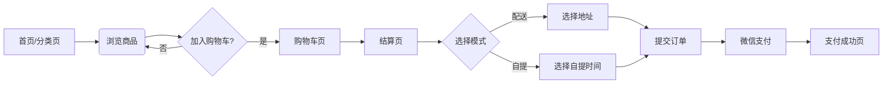
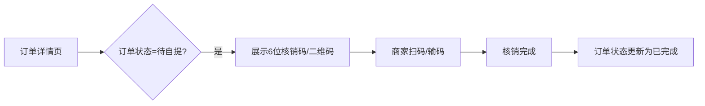

# C端小程序开发规划文档 (V1.0.0)

## 1. 项目概述

### 1.1 项目背景
本项目旨在构建一套轻量级、高效率的社区团购/外卖小程序系统。通过连接社区居民与商家，提供便捷的“配送到家”与“到店自提”双模式服务，解决社区最后一公里的购物需求。

### 1.2 核心功能
*   **双模式履约**：支持商家配送与用户自提，灵活满足不同场景需求。
*   **极简购物流程**：分类浏览 -> 购物车 -> 一键下单 -> 微信支付。
*   **实时状态追踪**：从下单、接单、配送/待自提到完成的完整状态流转。
*   **资金直连**：接入微信支付直连商户号，资金T+1直接到账商家，合规安全。

### 1.3 目标用户群体
*   **主要用户**：社区周边的居民（家庭主妇、上班族、老年人）。
*   **使用场景**：下班途中预订晚餐食材（自提）、周末居家点外卖（配送）。

### 1.4 关键业务指标 (KPIs) & 成功标准
*   **性能指标**：首屏加载时间 < 1.5s，API响应时间 < 200ms。
*   **业务指标**：
    *   **下单转化率**：访问至下单转化率 > 20%。
    *   **核销成功率**：自提订单核销率 100%（无漏单）。
*   **成功标准**：完成 MVP 版本上线，跑通核心交易链路（下单-支付-核销/送达），无严重阻断性 Bug。

---

## 2. 功能需求

### 2.1 核心功能模块

| 模块 | 功能点 | 详细描述 | 优先级 |
| :--- | :--- | :--- | :--- |
| **用户认证** | 微信登录 | 基于 `wx.login` 获取 OpenID，JWT 鉴权，自动注册/登录 | P0 |
| **首页展示** | Banner/推荐 | 顶部轮播图展示活动，下方推荐热销商品 | P1 |
| **商品浏览** | 分类/列表 | 左侧分类导航，右侧商品流；支持点击查看详情 | P0 |
| **购物车** | 加购/结算 | 本地存储购物车数据，支持增减数量、计算总价、去结算 | P0 |
| **订单结算** | 预检/下单 | 填写/选择收货地址，选择配送/自提方式，计算运费，调起支付 | P0 |
| **订单管理** | 列表/详情 | 查看订单状态（待接单、待自提等），展示核销码（自提单） | P0 |
| **地址管理** | CRUD | 新增、修改、删除收货地址，设置默认地址 | P1 |

### 2.2 用户交互流程 (User Flow)

#### 2.2.1 购物下单流程

#### 2.2.2 自提核销流程

---

## 3. 技术方案

### 3.1 技术栈 (Technology Stack)
*   **开发框架**：[Uni-app](https://uniapp.dcloud.net.cn/) (Vue 3 + TypeScript + Vite)
    *   *选择理由*：一套代码编译发布微信小程序，Vue3 组合式 API 开发体验佳，TS 提供类型安全。
*   **UI 规范**：原生 CSS / Uni-ui (按需引入)
    *   *原则*：保持轻量，避免引入庞大的第三方 UI 库导致包体积过大。
*   **状态管理**：[Pinia](https://pinia.vuejs.org/)
    *   *用途*：管理购物车数据、用户信息、全局配置（如营业状态）。
*   **网络请求**：封装 `uni.request`
    *   *功能*：统一拦截请求注入 Token，统一拦截响应处理错误码 (401 跳转登录)。

### 3.2 系统架构设计
采用典型的 **Client-Server** 架构：

*   **Client (小程序)**：负责 UI 展示、用户交互、本地缓存 (Storage)。
*   **Server (FastAPI)**：提供 RESTful API，处理业务逻辑、数据库读写、与微信接口交互。
*   **Database (PostgreSQL)**：存储用户、商品、订单数据。

### 3.3 数据模型 (Data Model) - 简略版
*(详细定义见 `docs/db 规划.md`)*

*   **User**: `id`, `openid`, `nickname`, `avatar`
*   **Product**: `id`, `name`, `price`, `stock`, `category_id`
*   **Order**: `id`, `order_no`, `status`, `delivery_type`, `pickup_code`, `address_snapshot`

---

## 4. 开发计划

基于 MVP (Minimum Viable Product) 原则，开发周期预计 **3周**。

### 4.1 里程碑规划

#### 📅 Phase 1: 基础架构与静态页面 (Week 1)
*   **目标**：完成项目搭建，所有静态页面可见，基础数据跑通。
*   **任务**：
    *   [x] 项目初始化 (Uni-app + TS + Pinia)。
    *   [ ] 封装 HTTP 请求类 (Request Interceptor)。
    *   [ ] 开发 TabBar 页面：首页、分类、购物车、我的。
    *   [ ] 实现 Mock 数据展示商品列表。
    *   [ ] 购物车逻辑 (本地增删改查)。

#### 📅 Phase 2: 核心交易链路联调 (Week 2)
*   **目标**：跑通下单全流程，实现真实数据交互。
*   **任务**：
    *   [ ] 接入后端 API：分类、商品列表。
    *   [ ] 用户登录模块 (wx.login -> 后端换 Token)。
    *   [ ] 结算页逻辑 (运费计算、营业时间判断)。
    *   [ ] 下单接口联调 (创建订单 -> 预支付参数)。
    *   [ ] 微信支付调起与回调处理。

#### 📅 Phase 3: 完善与验收 (Week 3)
*   **目标**：自提/配送闭环，Bug 修复，UI 细节打磨。
*   **任务**：
    *   [ ] 订单列表与详情页 (状态机渲染)。
    *   [ ] 自提核销码展示。
    *   [ ] 地址管理模块。
    *   [ ] 性能优化 (图片懒加载、包体积压缩)。
    *   [ ] 真机测试与验收。

---

## 5. 测试方案

### 5.1 测试策略
*   **单元测试**：针对复杂的纯逻辑函数进行测试。
    *   *范围*：购物车金额计算逻辑、营业时间判断逻辑。
*   **集成测试**：针对关键业务链路进行联调测试。
    *   *范围*：下单流程、支付流程（使用沙箱或小额真实支付）。
*   **兼容性测试**：确保在主流机型上表现一致。
    *   *范围*：iOS (iPhone X/13/15), Android (华为/小米/OPPO)。

### 5.2 质量标准
*   **功能性**：核心功能（下单、支付、核销）无阻塞性 Bug。
*   **稳定性**：弱网环境下（如电梯间）有友好的 Loading 和重试机制，不崩溃。
*   **UI/UX**：界面无错位，交互流畅，符合设计稿还原度 > 90%。

---

## 6. 部署方案

### 6.1 版本控制策略
遵循 **Semantic Versioning (语义化版本)**：`vMajor.Minor.Patch` (如 v1.0.0)。

*   **Branch 管理**：
    *   `main`: 生产环境稳定分支。
    *   `develop`: 开发分支。
    *   `feature/xxx`: 具体功能分支（如 `feature/cart`）。

### 6.2 发布流程
1.  **开发环境**：本地 `npm run dev:mp-weixin` 调试。
2.  **体验版**：
    *   开发者工具 -> 上传 -> 设为体验版。
    *   内部测试人员扫码测试。
3.  **正式版**：
    *   体验版测试通过 -> 提交审核 (微信后台)。
    *   审核通过 -> 全量发布。

### 6.3 监控与运维
*   **前端监控**：利用微信小程序后台的“运维中心”，监控 JS 错误率、API 调用失败率。
*   **日志记录**：关键操作（如支付、核销）在后端记录详细 Log。
